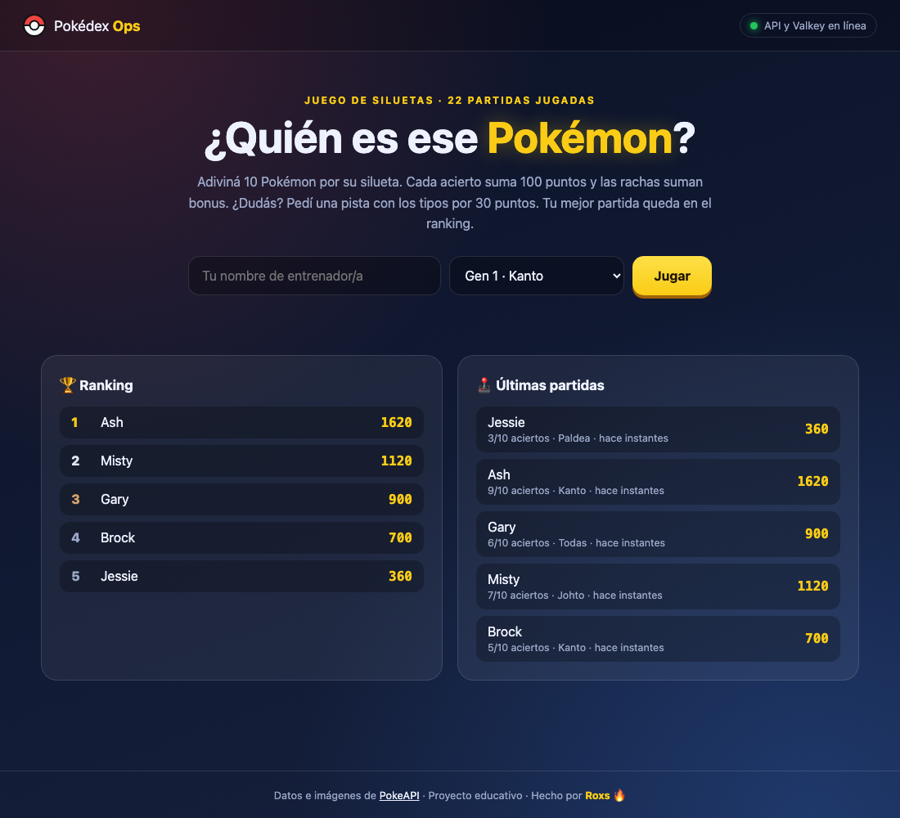
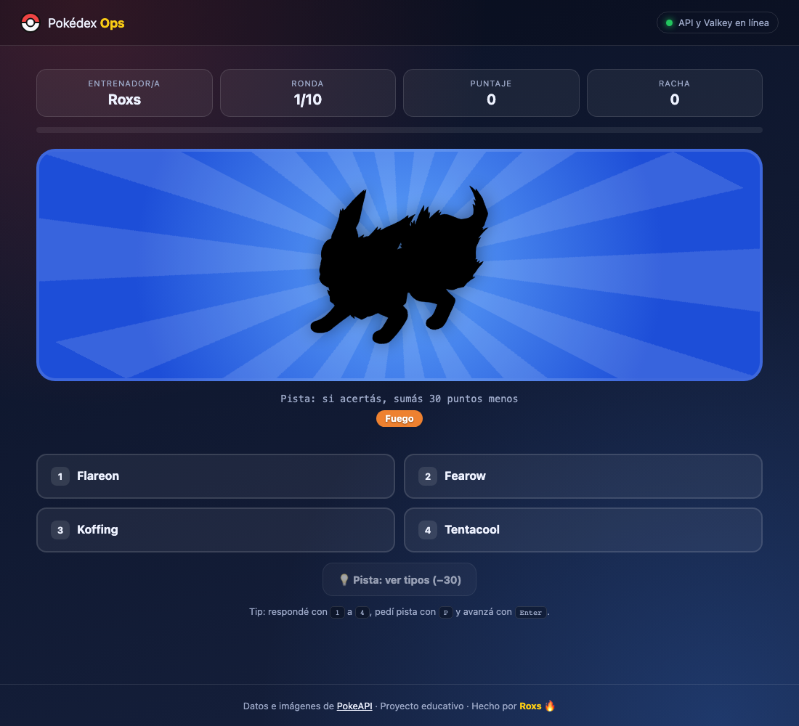
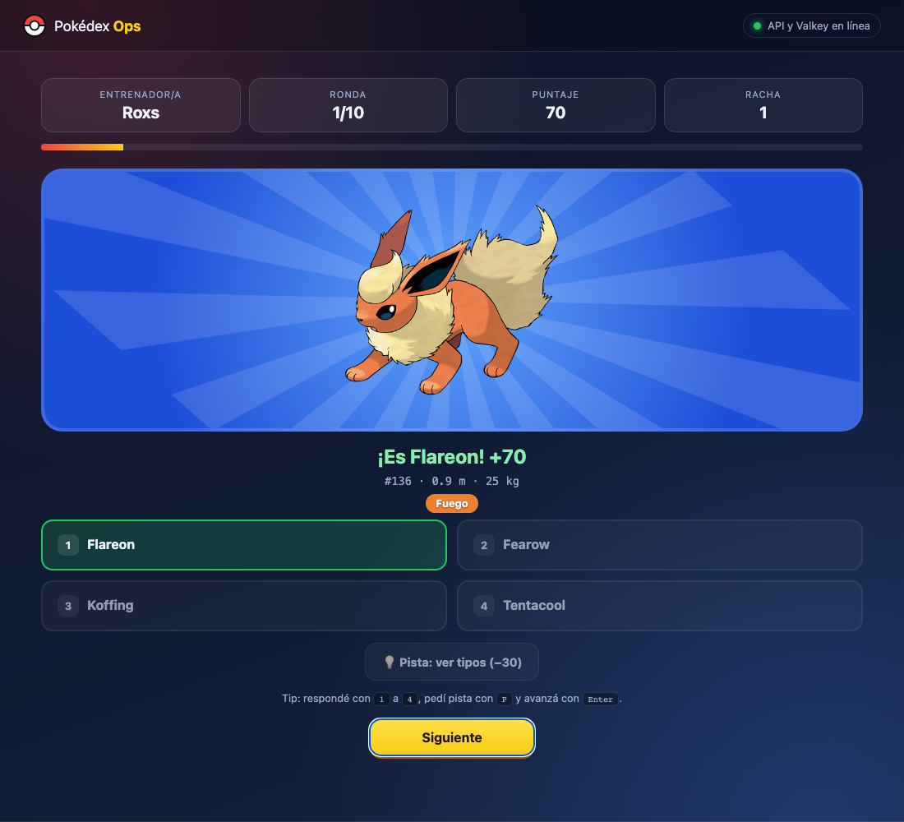
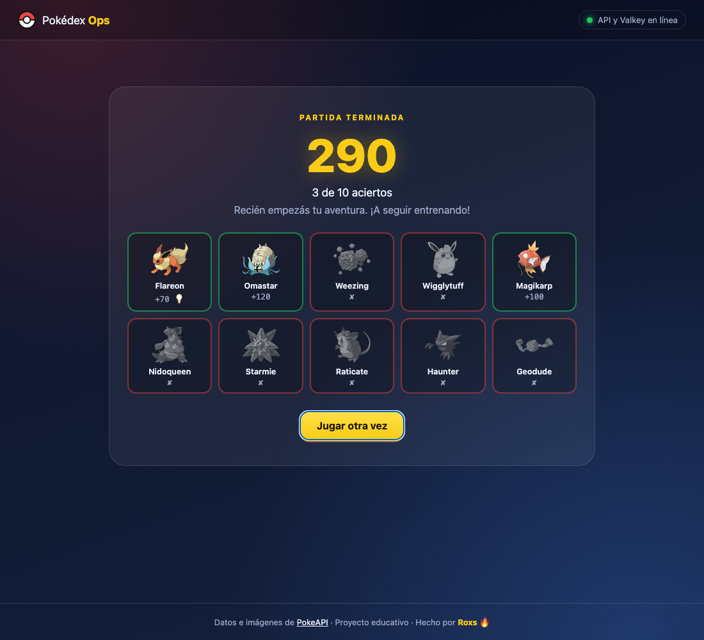
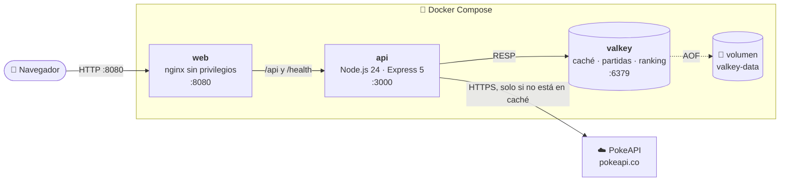
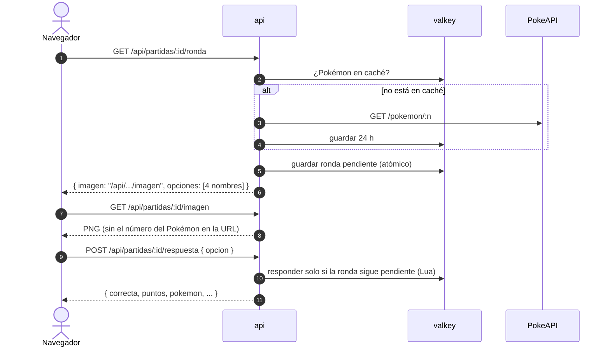

<p align="center">
  
</p>

# ¿Quién es ese Pokémon? · Pokédex Ops

Laboratorio **"Construí una aplicación con IA"**: diseñás, generás, revisás y mejorás un juego web completo usando la IA como copiloto, y lo levantás con Docker Compose.

El juego es el clásico de la tele: ves la silueta de un Pokémon y tenés que adivinar cuál es. Tiene un frontend estático, una API en Node.js que consulta [PokeAPI](https://pokeapi.co) y Valkey para la caché, las partidas y el ranking.

> Este repositorio es la **solución de referencia**. Si la IA no genera algo que cumpla el contrato, de acá podés copiar la pieza que te falte y seguir adelante.

---

## Índice

1. [Qué vas a aprender](#qué-vas-a-aprender)
2. [Requisitos](#requisitos)
3. [Probá la versión terminada](#probá-la-versión-terminada)
4. [Arquitectura](#arquitectura)
5. [El laboratorio paso a paso](#el-laboratorio-paso-a-paso)
6. [Explorá Valkey por dentro](#explorá-valkey-por-dentro)
7. [Probá la resiliencia](#probá-la-resiliencia)
8. [Problemas frecuentes](#problemas-frecuentes)
9. [Retos extra](#retos-extra)
10. [Referencia rápida](#referencia-rápida)

---

## Qué vas a aprender

- A **pedirle a la IA lo que necesitás**: contexto, contrato y restricciones claras, en vez de "haceme un juego".
- A **validar lo que genera** con una prueba automática, no solo con "parece que anda".
- A **revisar código con criterio**: seguridad, validación de entrada, caché, expiración y condiciones de carrera.
- A **agregar funcionalidades con cambios mínimos** sin romper lo que ya funciona.
- A orquestar varios servicios con **Docker Compose**: healthchecks, redes, volúmenes y usuarios sin privilegios.
- A usar **Valkey** (el fork libre de Redis) como caché, almacén de sesiones y ranking.

## Requisitos

| Herramienta | Para qué | Cómo lo verifico |
|---|---|---|
| Docker con Compose v2 | Levantar los tres servicios | `docker compose version` |
| `bash` y `curl` | Correr la prueba de la API | `curl --version` |
| Git | Clonar el repo | `git --version` |
| Un asistente de IA | Generar el código con los prompts | ChatGPT, Claude, Gemini, Copilot… el que uses |
| Conexión a internet | Consultar PokeAPI la primera vez | `curl -sI https://pokeapi.co` |

Además necesitás libres los puertos **8080** (juego) y **3000** (API).

## Probá la versión terminada

Antes de construir, mirá a dónde vas a llegar:

```bash
git clone <url-de-este-repo> roxs-pokedex-ops
cd roxs-pokedex-ops
docker compose up -d --build
```

- 🎮 Juego: <http://localhost:8080>
- 🩺 API (solo desde tu máquina): <http://localhost:3000/health>

### Cómo se juega

- Escribí tu nombre, elegí una generación (de Kanto a Paldea, o todas mezcladas) y adiviná 10 Pokémon por su silueta.
- Cada acierto suma **100 puntos** y las rachas suman **+20** por cada acierto seguido.
- ¿Dudás? La **pista** 💡 te muestra los tipos, pero el acierto vale 30 puntos menos.
- Si recargás la página, podés **continuar la partida** donde la dejaste.
- Al final ves el resumen de los 10 Pokémon y tu mejor puntaje queda en el **ranking**.
- Atajos: <kbd>1</kbd>–<kbd>4</kbd> para responder, <kbd>P</kbd> para la pista y <kbd>Enter</kbd> para avanzar.

| Inicio | Silueta con pista |
|---|---|
|  |  |
| **Revelado** | **Resumen final** |
|  |  |

### La prueba de la API

Con el stack levantado, dejá que un bot juegue una partida completa:

```bash
bash scripts/probar-api.sh roxs
```

Si termina con `✅ La API pasó todas las pruebas`, todo está en orden. Además de jugar, la prueba verifica que:

- la validación de entrada devuelva `400`;
- la imagen de la ronda **no revele la respuesta**;
- pedir la ronda de nuevo devuelva **la misma**;
- la pista funcione;
- dos respuestas **simultáneas** cuenten una sola vez.

Vas a usar esta misma prueba para validar **tu** versión.

## Arquitectura



### Una ronda por dentro

El diagrama muestra por qué el navegador **nunca** conoce la respuesta antes de responder: el Pokémon elegido queda guardado en Valkey y la imagen sale de la API, no de PokeAPI.



| Servicio | Imagen | Qué hace |
|---|---|---|
| `web` | `nginx-unprivileged` | Sirve el frontend y reenvía `/api` y `/health` a la API. Todo sale de un solo origen, así que no hay problemas de CORS. Corre sin root. |
| `api` | `node:24-alpine` | Express 5. Tiene la lógica del juego y consulta PokeAPI con caché. **La respuesta correcta nunca sale del servidor antes de que respondas.** Corre como el usuario `node`. |
| `valkey` | `valkey/valkey:8-alpine` | Guarda la caché de PokeAPI (24 h), las partidas en curso (1 h), el ranking (sorted set) y el historial (lista). Persiste en un volumen con AOF. |

Decisiones que vale la pena mirar:

- **Arranque en orden**: `web` espera a que `api` esté *healthy*, y `api` espera a `valkey`. Lo resuelven los `healthcheck` y `depends_on.condition` de [compose.yaml](compose.yaml).
- **La API solo escucha en `127.0.0.1:3000`**: podés probarla con curl desde tu máquina, pero no queda expuesta a la red.
- **Uso justo de PokeAPI**: cada Pokémon se pide una sola vez y después se sirve desde Valkey (patrón *cache-aside*).
- **Imagen por la API**: la URL original lleva el número del Pokémon (`.../official-artwork/25.png` es Pikachu), así que la API descarga la imagen y la sirve desde una ruta propia.

## El laboratorio paso a paso

Cada paso usa uno de los prompts de [prompts/](prompts/). Copialo en tu asistente de IA, revisá lo que genera y verificalo antes de pasar al siguiente.

Trabajá en una carpeta nueva para tu versión:

```bash
mkdir mi-pokedex && cd mi-pokedex
mkdir api web scripts
cp ../roxs-pokedex-ops/compose.yaml ../roxs-pokedex-ops/scripts/probar-api.sh .
mv probar-api.sh scripts/
```

### Paso 1 · Diseñar la arquitectura

📄 [prompts/01-arquitectura.md](prompts/01-arquitectura.md)

Le pedís a la IA que diseñe los componentes, la base de datos, el modelo de datos y las rutas, **sin escribir código todavía**.

**Qué revisar en la respuesta:**

- [ ] ¿Separa frontend y backend en contenedores distintos?
- [ ] ¿Propone una caché para PokeAPI?
- [ ] ¿Las partidas abandonadas expiran solas (por ejemplo, con un TTL)?
- [ ] ¿La respuesta correcta queda solo en el servidor?
- [ ] ¿Compara Valkey con PostgreSQL con argumentos concretos?

💡 Compará su propuesta con [docs/contrato-api.md](docs/contrato-api.md). No tiene que ser igual, pero en los pasos siguientes vas a usar **este** contrato para que la prueba automática funcione.

### Paso 2 · Generar la API

📄 [prompts/02-api.md](prompts/02-api.md)

El prompt incluye el contrato exacto: rutas, campos, claves de Valkey y reglas del juego. Guardá los archivos que genere en `api/` (`package.json`, `valkey.js`, `pokeapi.js`, `juego.js`, `server.js`, `Dockerfile` y `.dockerignore`).

**Verificalo:**

```bash
docker compose up -d --build api valkey
curl localhost:3000/health                  # tiene que responder: ok
bash scripts/probar-api.sh yo          # juega una partida entera
```

> La prueba de la API del repo ya incluye las mejoras de los pasos 4 y 5 (imagen servida por la API, pista y respuestas simultáneas). Con la API recién generada es **esperable** que falle en esos puntos: anotá dónde falla, porque es justo lo que vas a arreglar después.

**Si algo no anda:** mirá los logs con `docker compose logs api` y pasale el error a la IA. Si seguís sin avanzar, copiá el archivo que te falte desde [api/](api/).

### Paso 3 · Generar el frontend

📄 [prompts/03-web.md](prompts/03-web.md)

Guardá `index.html`, `styles.css` y `app.js` en `web/`. Para el `Dockerfile` y el `nginx.conf` podés usar los de [web/](web/): el foco de este paso está en la interfaz.

**Verificalo:**

```bash
docker compose up -d --build
```

Abrí <http://localhost:8080> y jugá una partida entera.

- [ ] ¿El indicador de salud de arriba está en verde?
- [ ] ¿Se ve la silueta negra y se revela al responder?
- [ ] ¿Funcionan los atajos <kbd>1</kbd>–<kbd>4</kbd>?
- [ ] ¿Tu puntaje aparece en el ranking al terminar?
- [ ] Probá anotarte con el nombre `<b>hola</b>`. En el ranking tiene que aparecer tal cual, con las etiquetas, y no **hola** en negrita. Si sale en negrita, el frontend usa `innerHTML` y es vulnerable a inyección de HTML.

### Paso 4 · Revisar el código

📄 [prompts/04-revision.md](prompts/04-revision.md)

Le pasás tu API y tu frontend a la IA y le pedís **solo el diagnóstico**, en una tabla con severidad y una forma de verificar cada hallazgo.

**Dos hallazgos que una buena revisión tiene que encontrar** (la versión 1.0 de este repo los tenía):

| Hallazgo | Severidad | Cómo verificarlo |
|---|---|---|
| **La imagen revela la respuesta.** Si `imagen` es la URL de PokeAPI, el número al final del archivo es el Pokémon. | Alta | `curl localhost:3000/api/partidas/<id>/ronda` y mirá la URL |
| **Responder dos veces a la vez puntúa doble.** Leer el estado, calcular y escribir no es atómico. | Media | Mandá dos `POST /respuesta` en paralelo con `&` y compará el puntaje |

Si la IA no los encuentra, preguntale por cada punto de la lista. **Revisar lo que genera la IA es parte del trabajo**: una respuesta segura de sí misma también puede estar equivocada.

👉 Así los resuelve la referencia:

- **Imagen**: ruta `GET /api/partidas/:id/imagen`, que sirve la imagen desde Valkey ([api/pokeapi.js](api/pokeapi.js)).
- **Carrera**: un script Lua que escribe solo si la ronda sigue pendiente, en un único paso atómico ([api/juego.js](api/juego.js)).

### Paso 5 · Agregar una funcionalidad con cambio mínimo

📄 [prompts/05-mejoras.md](prompts/05-mejoras.md)

Elegí una funcionalidad y pedile a la IA que la agregue **sin cambiar las rutas existentes ni sumar dependencias**. Ideas que ya resuelve la referencia:

| Funcionalidad | Qué toca |
|---|---|
| 💡 Pista con los tipos (−30 puntos) | Ruta `POST /api/partidas/:id/pista`, campo `pista` en la respuesta |
| 🗺️ Elegir generación (1 a 9, o todas) | Campo opcional `generacion` al crear la partida, ruta `GET /api/generaciones` |
| 🔄 Continuar la partida al recargar | Ruta `GET /api/partidas/:id` y `localStorage` en el frontend |
| 📋 Resumen final con los 10 Pokémon | Campo `resumen` en el estado de la partida |

**Verificalo:** corré otra vez la prueba de la API. Si lo que ya funcionaba se rompió, el cambio no fue mínimo.

```bash
bash scripts/probar-api.sh yo
bash scripts/probar-api.sh yo http://localhost:8080 9   # generación 9, pasando por nginx
```

### ✅ Terminaste cuando…

- [ ] `docker compose up -d --build` levanta los tres servicios en estado *healthy* (`docker compose ps`).
- [ ] `bash scripts/probar-api.sh` termina con `✅`.
- [ ] Podés jugar una partida completa en el navegador.
- [ ] Tu revisión encontró y corrigió al menos un problema de seguridad o de concurrencia.
- [ ] Agregaste una funcionalidad sin romper la prueba de la API.

## Explorá Valkey por dentro

Abrí una consola de Valkey y mirá cómo se guarda cada cosa:

```bash
docker compose exec valkey valkey-cli
```

```text
KEYS pokeapi:*                          # qué hay en caché
TTL pokeapi:pokemon:25                  # cuántos segundos le quedan a Pikachu
KEYS partida:*                          # partidas en curso
HGETALL partida:<id>                    # el estado de una partida (acá sí está la respuesta)
TTL partida:<id>                        # expira sola en una hora
ZRANGE ranking 0 -1 REV WITHSCORES      # el ranking completo
LRANGE historial 0 -1                   # las últimas 10 partidas
GET stats:partidas                      # contador de partidas creadas
```

El modelo de datos completo está en [docs/contrato-api.md](docs/contrato-api.md#modelo-de-datos-en-valkey).

💡 **Mirá la caché en acción:** la primera ronda con un Pokémon nuevo tarda más, porque va a PokeAPI. Las siguientes salen de Valkey. Probalo con `time curl localhost:3000/api/partidas/<id>/ronda`.

## Probá la resiliencia

| Experimento | Comando | Qué debería pasar |
|---|---|---|
| Se cae Valkey | `docker compose stop valkey` | El indicador se pone rojo y la API responde `503`. Al volver (`docker compose start valkey`), se recupera sola. |
| Se reinicia Valkey | `docker compose restart valkey` | El ranking sigue ahí, gracias al volumen y a AOF. |
| Se reinicia la API | `docker compose restart api` | Tarda menos de un segundo: la API cierra ordenadamente al recibir `SIGTERM`. |
| Sin internet | Desconectate y pedí un Pokémon que no esté en caché | La API responde `502` con "No se pudo consultar PokeAPI". |
| Borrar todo | `docker compose down -v` | Se borra el volumen: el ranking y la caché empiezan de cero. |

## Problemas frecuentes

| Síntoma | Causa probable | Solución |
|---|---|---|
| `port is already allocated` | El 8080 o el 3000 está ocupado | Cerrá lo que lo usa o cambiá el puerto de la izquierda en `compose.yaml` (`"8081:8080"`) |
| La API responde `503 Valkey no disponible` | Valkey no arrancó o todavía no está listo | `docker compose ps` y `docker compose logs valkey` |
| La API responde `502 No se pudo consultar PokeAPI` | Sin internet o PokeAPI lenta | Revisá la conexión con `curl -sI https://pokeapi.co` y reintentá |
| El juego carga pero no aparece el ranking | nginx no llega a la API | `docker compose logs web`; verificá que `api` esté *healthy* |
| La prueba de la API falla en "la imagen revela la respuesta" | Tu API devuelve la URL de PokeAPI en `imagen` | Es el hallazgo del [paso 4](#paso-4--revisar-el-código) |
| Los cambios no se ven | La imagen de Docker quedó vieja | `docker compose up -d --build` (con `--build`) |
| Quiero empezar de cero | — | `docker compose down -v` |

## Retos extra

¿Terminaste y te quedaste con ganas? Probá con estos, siempre con el prompt 5 y la prueba de la API como red de seguridad:

- ⏱️ **Bonus por velocidad**: guardá en el servidor cuándo empezó la ronda y sumá puntos si respondés en menos de 5 segundos.
- 🏅 **Ranking por generación**: un sorted set por región (`ranking:gen1`, `ranking:gen2`…).
- 📕 **Mi Pokédex**: un set por jugador/a con los Pokémon que adivinó (`SADD pokedex:<jugador> <id>`).
- 🇪🇸 **Nombres en español** donde existan, usando `names` de `/pokemon-species`.
- 🚦 **Límite de pedidos** por IP, usando `INCR` y `EXPIRE` en Valkey.
- 🤖 **CI**: un workflow de GitHub Actions que levante el stack y corra `probar-api.sh` en cada push.
- 📈 **Métricas**: una ruta `/metrics` con partidas, aciertos y aciertos de caché, en formato Prometheus.

## Referencia rápida

### Estructura

```text
api/            API en Node.js
  server.js       rutas HTTP y manejo de errores
  juego.js        reglas del juego y escrituras atómicas
  pokeapi.js      acceso a PokeAPI con caché e imágenes
  valkey.js       cliente de Valkey
web/            frontend estático (HTML, CSS y JS sin frameworks) y nginx
docs/           contrato de la API y modelo de datos en Valkey
  img/            capturas del README
prompts/        los 5 prompts del laboratorio
scripts/
  probar-api.sh   prueba de la API con curl
  capturas/       genera las capturas del README con Playwright
compose.yaml    los tres servicios
```

### Rutas de la API

| Método y ruta | Qué hace |
|---|---|
| `GET /health` | Salud de la API y de Valkey |
| `GET /api/info` | Versión y cantidad de partidas |
| `GET /api/generaciones` | Generaciones disponibles |
| `POST /api/partidas` | Crea una partida |
| `GET /api/partidas/:id` | Estado de la partida (para retomarla) |
| `GET /api/partidas/:id/ronda` | Ronda actual: imagen y 4 opciones |
| `GET /api/partidas/:id/imagen` | Imagen de la ronda pendiente |
| `POST /api/partidas/:id/pista` | Tipos del Pokémon, con costo de 30 puntos |
| `POST /api/partidas/:id/respuesta` | Responde y revela el Pokémon |
| `GET /api/ranking` | Top 10 |
| `GET /api/historial` | Últimas 10 partidas |

El detalle de campos, códigos de error y reglas está en [docs/contrato-api.md](docs/contrato-api.md).

### Comandos útiles

```bash
docker compose up -d --build      # levantar (y reconstruir)
docker compose ps                 # estado y healthchecks
docker compose logs -f api        # logs de la API en vivo
docker compose restart api        # reiniciar un servicio
docker compose down               # apagar (conserva el ranking)
docker compose down -v            # apagar y borrar los datos
```

### Regenerar las capturas

Las imágenes de [docs/img/](docs/img/) las genera [scripts/capturas/capturas.js](scripts/capturas/capturas.js): abre un Chromium headless, juega una partida y guarda una captura de cada pantalla. Con el stack levantado:

```bash
cd scripts/capturas
npm install && npx playwright install chromium
node capturas.js                 # o: node capturas.js http://otra-url:8080
```

Las capturas muestran el ranking y el historial que haya en ese momento en Valkey, así que conviene generarlas con datos de ejemplo. Playwright se usa solo para esto: no es una dependencia de la API ni del frontend.

## Créditos

Datos e imágenes de [PokeAPI](https://pokeapi.co), que pide cachear los recursos que se consultan: esta API los guarda en Valkey durante 24 horas.

Pokémon y sus nombres son marcas registradas de Nintendo, Creatures Inc. y GAME FREAK Inc. Este es un proyecto educativo sin fines comerciales y sin afiliación con ellas.

---

<p align="center">Hecho por <b>Roxs</b> 🔥 · Build with Fire · <a href="https://roxs.dev">roxs.dev</a></p>
